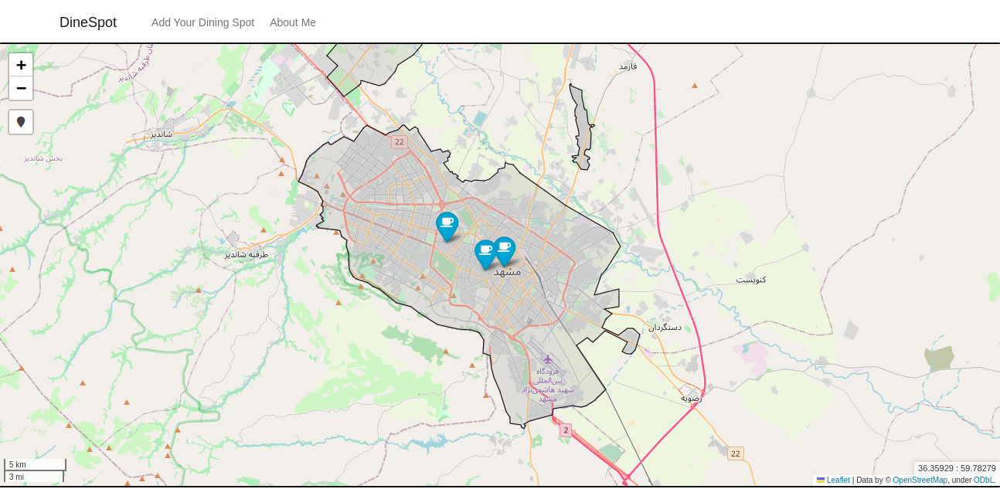

# DineSpot


<br><br>

A small project using [Django](!https://www.djangoproject.com/) and [Folium](!https://python-visualization.github.io/folium/). 

In DineSpot, users can view all the dining spots in Mashhad along with their details. Also the owners of dining spots can request adding their own place via a Django form. 

## How to run the project
DineSpot is dockerized, so the only thing you will need is docker and docker-compose. In order to start the project just follow these steps:

### Clone the project:

```
git clone https://github.com/FatemeFouladkar/DineSpot.git
```

### Add environment variables
Rename the `.env.example` to `.env` and fill out the necessary environment variables:
```
PORT=
SECRET_KEY=

POSTGRES_DB=
POSTGRES_USER=
POSTGRES_PASSWORD=
POSTGRES_HOST=
POSTGRES_PORT=

EMAIL_HOST_USER=
EMAIL_HOST_PASSWORD=
EMAIL_HOST=
EMAIL_PORT=
EMAIL_USE_TLS=
``` 

### Build docker images:
```
docker-compose build
```

### Start and run the containers:
```
docker-compose up
```

If any of the migrations are missing, run the below commands:
```
docker-compose exec web python manage.py makemigrations
docker-compose exec web python manage.py migrate
```
### Create superuser
```
docker-compose exec web python manage.py createsuperuser
```

## WorkFlow
On the main page, you'll be able to see a map of Mashhad and all the dining spots, specified with folium markers:



By clicking on each marker, you'll be able to see all the available data about the dining spot:


In order to request for new dining spots, click on 'Add Your Dining Spot' on the menu. Fill the form in the new page to send out your request:


When the request is submitted, an email will be sent to the superuser, so that he can confirm the new dining spot. 
As the superuser, you can login to the admin panel by heading to `localhost:8000/admin`. You'll be able so view all the dining spots like so:


You can confirm the new record using admin actions, or just heading to the details page of the new dining spot. 

In order to show the right location of the new places on the map, you need to update the map in the admin panel:


As the new dining spot is confirmed, a new email will be sent to the dining owner to inform them. 

## Contributing

All contributions to this projects are welcome! If you have any suggestions to improve the project, please open open an issue, or just make pr.

